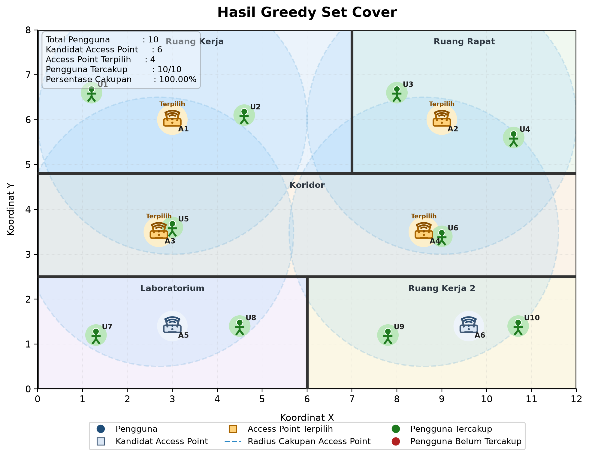

# Greedy Wi-Fi Placement

> Makalah IF2211 Strategi Algoritma

<p align="center">
  
</p>

Program simulasi penempatan **Access Point Wi-Fi** pada denah dua dimensi menggunakan pendekatan **Greedy Set Cover**. Program juga menyediakan mode pembanding menggunakan **Brute Force Set Cover** untuk memperoleh solusi optimal global pada skenario kecil.

Program membaca skenario dari file JSON, menghitung cakupan setiap kandidat Access Point berdasarkan jarak Euclidean, menjalankan algoritma pemilihan kandidat, lalu menghasilkan visualisasi denah awal dan hasil penempatan Access Point.

## Fitur

- Membaca data denah dari file JSON.
- Menghitung cakupan pengguna berdasarkan jarak Euclidean.
- Menjalankan algoritma Greedy Set Cover.
- Menjalankan Brute Force Set Cover sebagai pembanding solusi optimal.
- Menampilkan log iterasi pemilihan Access Point.
- Menampilkan ringkasan hasil greedy dan brute force.
- Menghasilkan visualisasi:
  - denah awal,
  - hasil Greedy Set Cover,
  - hasil Brute Force Set Cover.
- Mendukung eksekusi melalui PowerShell dan WSL/Linux.

## Struktur Proyek

```text
greedy-wifi-placement/
├── app.py
├── algorithm.py
├── coverage.py
├── visualization.py
├── requirements.txt
├── scenarios/
│   ├── denah.json
│   └── greedy-tidak-optimal.json
├── output/
│   └── .gitkeep
├── doc/
│   └── preview.png
└── README.md
```

Keterangan file utama:

| File                                  | Fungsi                                                                             |
| ------------------------------------- | ---------------------------------------------------------------------------------- |
| `app.py`                              | Entry point program, membaca skenario, menjalankan algoritma, dan menyimpan output |
| `algorithm.py`                        | Implementasi Greedy Set Cover dan Brute Force Set Cover                            |
| `coverage.py`                         | Menghitung cakupan kandidat Access Point terhadap pengguna                         |
| `visualization.py`                    | Membuat visualisasi denah dan hasil algoritma                                      |
| `scenarios/denah.json`                | Skenario dasar                                                                     |
| `scenarios/greedy-tidak-optimal.json` | Skenario pembanding ketika greedy tidak optimal                                    |
| `output/`                             | Folder hasil gambar yang dihasilkan program                                        |
| `doc/preview.png`                     | Gambar preview README                                                              |

## Requirements

Program membutuhkan Python 3 dan pustaka berikut:

```text
matplotlib
```

Dependensi tersedia di file:

```text
requirements.txt
```

## Instalasi

### PowerShell

Masuk ke folder proyek:

```powershell
cd "C:\path\to\greedy-wifi-placement"
```

Buat virtual environment:

```powershell
python -m venv .venv
```

Aktifkan virtual environment:

```powershell
.\.venv\Scripts\Activate.ps1
```

Install dependensi:

```powershell
python -m pip install -r requirements.txt
```

### WSL/Linux

Masuk ke folder proyek:

```bash
cd ~/path/to/greedy-wifi-placement
```

Buat virtual environment:

```bash
python -m venv .venv
```

Aktifkan virtual environment:

```bash
source .venv/bin/activate
```

Install dependensi:

```bash
python -m pip install -r requirements.txt
```

Catatan: seluruh command di README ini menggunakan `python`, bukan `python3`, karena pada beberapa environment perintah Python yang aktif adalah `python`.

## Cara Menjalankan

### Menjalankan skenario dasar

```bash
python app.py --scenario scenarios/denah.json
```

### Menjalankan skenario dasar dengan perbandingan brute force

```bash
python app.py --scenario scenarios/denah.json --compare
```

### Menjalankan skenario greedy tidak optimal

```bash
python app.py --scenario scenarios/greedy-tidak-optimal.json --output-dir output/tidak-optimal --compare
```

### Menampilkan visualisasi secara langsung

```bash
python app.py --scenario scenarios/denah.json --show
```

### Menentukan folder output

```bash
python app.py --scenario scenarios/denah.json --output-dir output/dasar --compare
```

## Argumen Program

| Argumen        | Keterangan                                                  |
| -------------- | ----------------------------------------------------------- |
| `--scenario`   | Path file JSON skenario                                     |
| `--output-dir` | Folder untuk menyimpan hasil gambar                         |
| `--show`       | Menampilkan visualisasi secara langsung                     |
| `--compare`    | Menjalankan Brute Force Set Cover sebagai pembanding greedy |

Contoh lengkap:

```bash
python app.py \
  --scenario scenarios/denah.json \
  --output-dir output/dasar \
  --compare \
  --show
```

## Format Skenario

Skenario disimpan dalam format JSON. Contoh struktur data:

```json
{
  "name": "Denah contoh",
  "width": 12,
  "height": 8,
  "radius": 3.0,
  "users": {
    "U1": [1.2, 6.6],
    "U2": [4.6, 6.1]
  },
  "candidates": {
    "A1": [3.0, 6.0],
    "A2": [9.0, 6.0]
  },
  "walls": [
    [
      [0.0, 4.8],
      [12.0, 4.8]
    ]
  ],
  "rooms": [
    {
      "name": "Ruang Kerja",
      "x": 0.0,
      "y": 4.8,
      "width": 7.0,
      "height": 3.2
    }
  ]
}
```

Keterangan field:

| Field        | Keterangan                                           |
| ------------ | ---------------------------------------------------- |
| `name`       | Nama skenario                                        |
| `width`      | Lebar denah                                          |
| `height`     | Tinggi denah                                         |
| `radius`     | Radius cakupan setiap Access Point                   |
| `users`      | Daftar pengguna dan koordinatnya                     |
| `candidates` | Daftar kandidat lokasi Access Point dan koordinatnya |
| `walls`      | Garis dinding untuk visualisasi                      |
| `rooms`      | Informasi ruangan untuk visualisasi                  |

Catatan: `walls` dan `rooms` hanya digunakan untuk visualisasi. Perhitungan cakupan hanya menggunakan koordinat pengguna, koordinat kandidat Access Point, dan radius.

## Output Program

Tanpa `--compare`, program menghasilkan:

```text
output/
├── denah.png
└── hasil-greedy.png
```

Dengan `--compare`, program menghasilkan:

```text
output/
├── denah.png
├── hasil-greedy.png
└── hasil-bruteforce.png
```

Keterangan output:

| File                   | Isi                                                                  |
| ---------------------- | -------------------------------------------------------------------- |
| `denah.png`            | Denah awal berisi pengguna dan kandidat lokasi Access Point          |
| `hasil-greedy.png`     | Denah hasil pemilihan Access Point menggunakan Greedy Set Cover      |
| `hasil-bruteforce.png` | Denah hasil pemilihan Access Point menggunakan Brute Force Set Cover |

Contoh ringkasan terminal:

```text
=== Log Iterasi Greedy Set Cover ===
Iterasi 1: pilih A4; pengguna baru tercakup = U4, U6, U9, U10; tersisa = U1, U2, U3, U5, U7, U8.
Iterasi 2: pilih A1; pengguna baru tercakup = U1, U2, U5; tersisa = U3, U7, U8.
Iterasi 3: pilih A3; pengguna baru tercakup = U7, U8; tersisa = U3.
Iterasi 4: pilih A2; pengguna baru tercakup = U3; tersisa = tidak ada.

=== Ringkasan Greedy ===
AP terpilih       : A4, A1, A3, A2
Jumlah AP         : 4
Pengguna tercakup : 10/10
Persentase        : 100.00%
Jumlah iterasi    : 4
Waktu eksekusi    : 0.0458 ms

=== Ringkasan Brute Force ===
AP terpilih       : A1, A2, A3, A4
Jumlah AP         : 4
Pengguna tercakup : 10/10
Persentase        : 100.00%
Kombinasi dicek   : 57
Waktu eksekusi    : 0.1200 ms

=== Perbandingan ===
Greedy      : 4 AP
Brute Force : 4 AP
Kesimpulan  : hasil greedy sama optimal dengan brute force.
```

## Ringkasan Algoritma

### Greedy Set Cover

Setiap kandidat Access Point merepresentasikan himpunan pengguna yang berada dalam radius cakupannya. Greedy Set Cover memilih kandidat secara bertahap dengan aturan:

1. Hitung pengguna yang belum tercakup.
2. Pilih kandidat Access Point yang mencakup pengguna belum tercakup paling banyak.
3. Tandai pengguna tersebut sebagai tercakup.
4. Ulangi hingga semua pengguna tercakup atau tidak ada kandidat yang memberi cakupan tambahan.

Jika terdapat beberapa kandidat dengan nilai cakupan tambahan yang sama, program memilih kandidat dengan ID terkecil secara leksikografis agar hasil eksekusi konsisten.

### Brute Force Set Cover

Brute Force mencoba seluruh kombinasi kandidat dari ukuran terkecil. Kombinasi pertama yang mencakup seluruh pengguna adalah solusi optimal berdasarkan jumlah Access Point minimum.

Metode ini menjamin solusi optimal global untuk skenario kecil, tetapi jumlah kombinasi yang diperiksa meningkat secara eksponensial, yaitu hingga `2^n` kemungkinan subset untuk `n` kandidat.

## Skenario Pengujian

### Skenario dasar

File:

```text
scenarios/denah.json
```

Skenario ini digunakan untuk menunjukkan proses pemilihan Access Point pada denah ruangan. Pada skenario ini, Greedy Set Cover menghasilkan jumlah Access Point yang sama dengan Brute Force.

### Skenario greedy tidak optimal

File:

```text
scenarios/greedy-tidak-optimal.json
```

Skenario ini digunakan untuk menunjukkan bahwa greedy tidak selalu optimal global. Pada skenario ini, Greedy Set Cover memilih kandidat dengan cakupan awal terbesar, tetapi hasil akhirnya membutuhkan lebih banyak Access Point dibandingkan solusi Brute Force.

## Batasan

- Setiap Access Point memiliki radius cakupan yang sama.
- Dinding belum memengaruhi kekuatan sinyal.
- Interferensi, kapasitas perangkat, kanal frekuensi, dan pelemahan sinyal belum dimodelkan.
- Brute Force hanya layak digunakan untuk skenario kecil karena kompleksitasnya eksponensial.
- Model digunakan untuk simulasi algoritmik, bukan perencanaan jaringan Wi-Fi nyata.

## Troubleshooting

### `python` tidak dikenali

Pastikan Python sudah terpasang dan masuk ke PATH. Cek dengan:

```bash
python --version
```

### `matplotlib` tidak ditemukan

Install ulang dependensi:

```bash
python -m pip install -r requirements.txt
```

### Virtual environment tidak bisa diaktifkan di PowerShell

Jalankan PowerShell sebagai user biasa, lalu gunakan:

```powershell
Set-ExecutionPolicy -Scope CurrentUser RemoteSigned
```

Setelah itu aktifkan ulang:

```powershell
.\.venv\Scripts\Activate.ps1
```

### File skenario tidak ditemukan

Pastikan path skenario benar, misalnya:

```bash
python app.py --scenario scenarios/denah.json
```

## Lisensi

Proyek ini dibuat untuk keperluan makalah IF2211 Strategi Algoritma.

```

```
